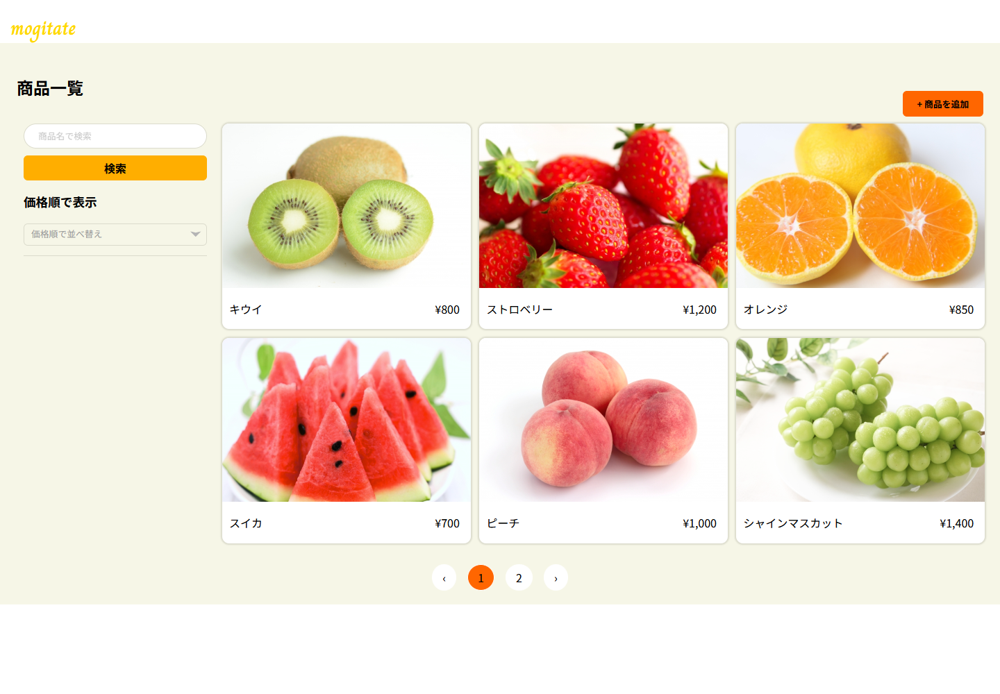
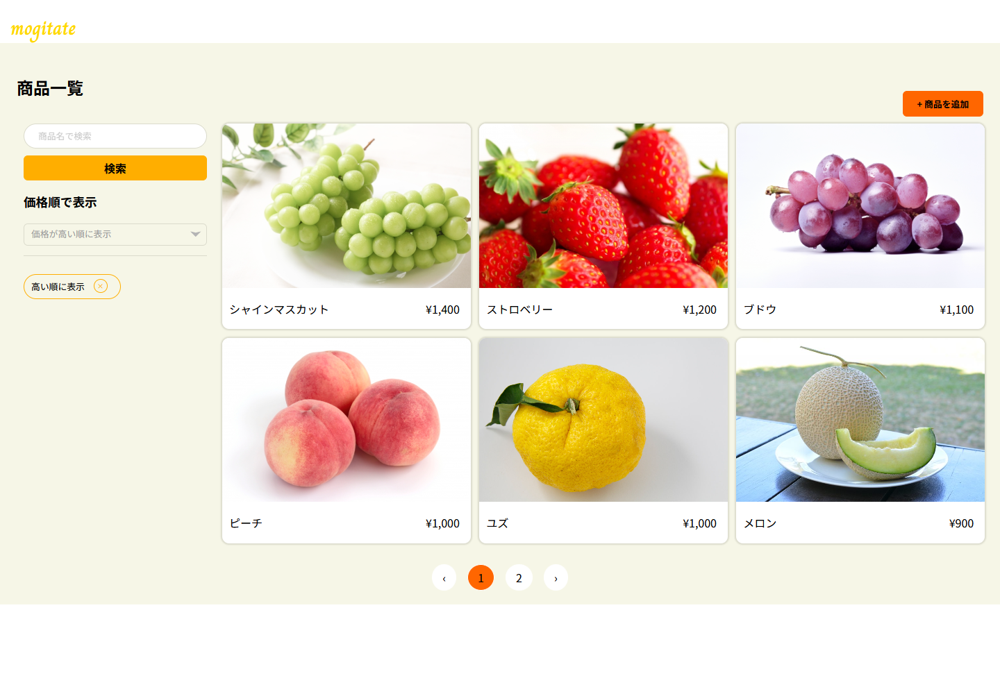
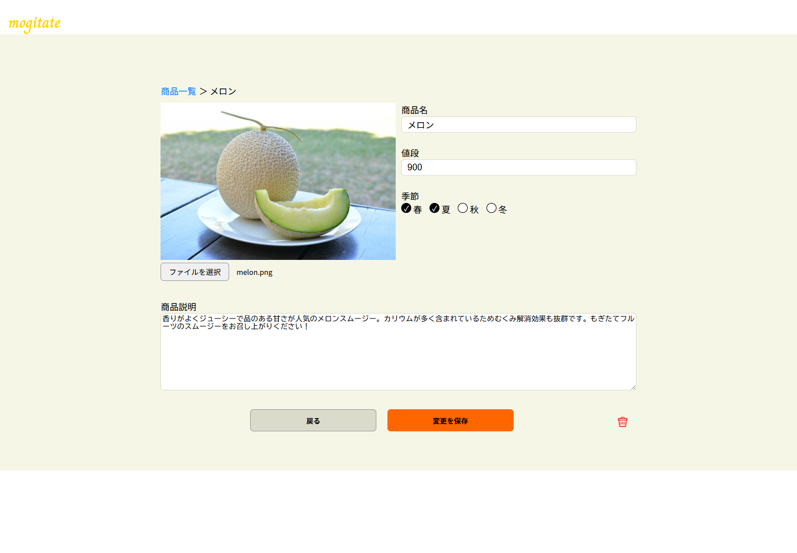
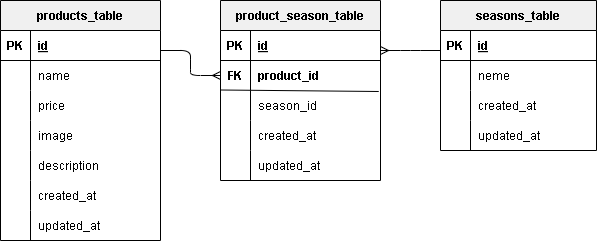

もぎたて

### mogitate（モギタテ）商品登録管理編集アプリ







### 機能要件

- **一覧表示から検索表示機能**: 商品名を入力フィールドに入力して「検索ボタン」をクリックすると入力情報と一致した商品名のカードのみ表示することができる。
- **商品並び替え機能**:「検索ボタン」下部のポップアップから「高い順に表示」、「低い順に表示」を選択して商品を並び替えることができる。結果の表示の際に、並び替え条件をタグに表示することができる。
- **商品削除機能**: 右下の「ゴミ箱ボタン」をクリックするとデーターベース(products テーブル)に保存されている商品情報を削除することができる。
- **バリデーション**: 登録と変更の際に FormRequest を使用してバリデーションを行う。
- **レスポンシブデザイン**: タブレット・スマートフォン用にブレイクポイント 768px でレスポンシブデザインを実装。
- **ストレージ**: 商品の画像をストレージに保存。

### 作業範囲

- 設計
- コーディング
- テスト

### システム要件

- **開発言語**: PHP
- **フレームワーク**: Laravel
- **データベース**: MySQL
- **バージョン管理**: GitHub

### 使用技術

- **フロントエンド**: HTML, CSS, JavaScript
- **バックエンド**: PHP, Laravel
- **データベース**: MySQL
- **バージョン管理**: Git, GitHub

### ライセンス

このプロジェクトは特定のクライアントにのみ提供される専用のソフトウェアです。再配布や商用利用は禁止されています。

#### 使用技術（実行環境）

- **開発言語**: PHP
- **フレームワーク**: Laravel 8.x
- **データベース**: MySQL
- **バージョン管理**: GitHub
- **コンテナ化技術**: Docker

#### ER 図



#### 環境構築

- **PHP**: 8.1.29
- **MySQL**: 10.11.6-MariaDB
- **Composer**: 2.7.7
- **Docker**: 27.4.0
- **Laravel Framework**: 8.83.27

- ＊ご使用の PC に合わせて各種必要なファイル(.env や docker-compose.yml 等)は作成、編集してください。

- **1.docker-compose exec bash**
- **2.composer install**
- **3..env.example ファイルから.env を作成し、環境変数を変更**
- **4.php artisan key:generate**
- **5.php artisan migrate**
- **6.php artisan db:seed**

####クローン作製手順

1. GitHub リポジトリのクローン

```bash
git clone https://github.com/ponponmama/20241220_hara_erika.git
```

```bash
cd 20241220_hara_erika
```

2. 必要なパッケージのインストール

```bash
sudo apt-get update
```

Docker コンテナのビルドと起動

```bash
docker-compose up -d --build
```

3. Composer を使用した依存関係のインストール

- Docker 環境で PHP コンテナに入り、依存関係をインストールします。

```bash
docker-compose exec php bash
```

```bash
composer install
```

4. 環境設定ファイルの設定

- .env.example ファイルを .env としてコピーし、必要に応じてデータベースなどの設定を行います。

```bash
cp .env.example .env
```

- 環境設定を更新した後、設定キャッシュをクリアするために以下のコマンドを実行します。これにより、新しい設定がアプリケーションに反映されます。

```bash
docker-compose exec php bash
```

```bash
php artisan config:clear
```

この手順は、特に環境変数が更新された後や、`.env` ファイルに重要な変更を加えた場合に重要です。設定キャッシュをクリアすることで、古い設定が引き続き使用されることを防ぎます。

5. 環境設定手順

**重要：このアプリでは、シンボリックリンクはすでに設定されており、リポジトリに含まれています。新しい環境でプロジェクトをセットアップする際は、リンクが正しく機能しているかを確認してください。機能していない場合は下記の通り設定しなおしてください。**

####ディレクトリの作成とストレージ設定

- プロジェクトを始める前に、以下のディレクトリを作成してください。これにより、ファイルの保存場所が正しく設定されます。
- 商品の画像の保存するために以下のディレクトリを作成してください。PHP コンテナ内で実行します。

```bash
php artisan storage:link
```

次に、これらのディレクトリに適切なパーミッションを設定してください。これにより、アプリケーションがファイルを適切に読み書きできるようになります。

```bash
chmod -R 775 /var/www/storage/app/public/images
```

```bash
chmod -R 775 /var/www/storage/app/public/qr_codes
```

```bash
chown -R www-data:www-data /var/www/storage/app/public
```

- シーダー用の画像を配置する

これらのコマンドは、アプリケーションが画像や QR コードを保存するためのディレクトリに適切なアクセス権を設定するために必要です。`www-data` はウェブサーバーのユーザーですが、使用しているサーバーによっては異なるユーザー名になる場合があるため、環境に合わせて適宜変更してください。

6. アプリケーションキーの生成

```bash
php artisan key:generate
```

6.データベースのマイグレーション

```bash
php artisan migrate
```

7.データベースシーダーの実行

```bash
php artisan db:seed
```

### URL

- **開発環境:** [http://localhost/](http://localhost/)
- **phpMyAdmin:** [http://localhost:8080/](http://localhost:8080/)
